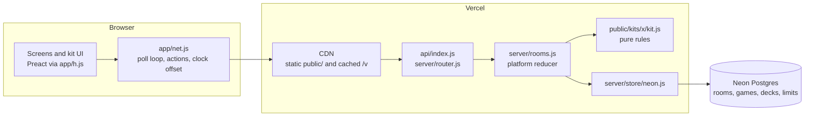
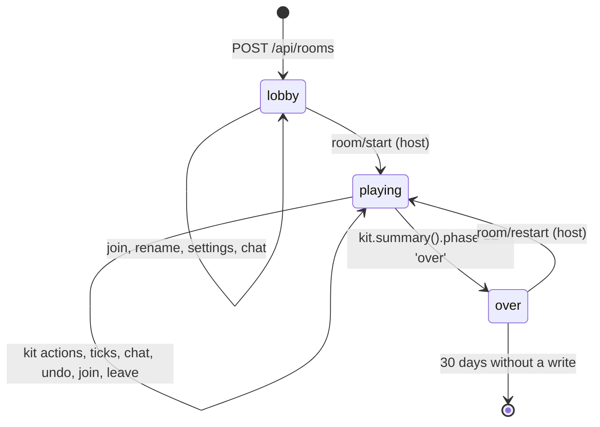
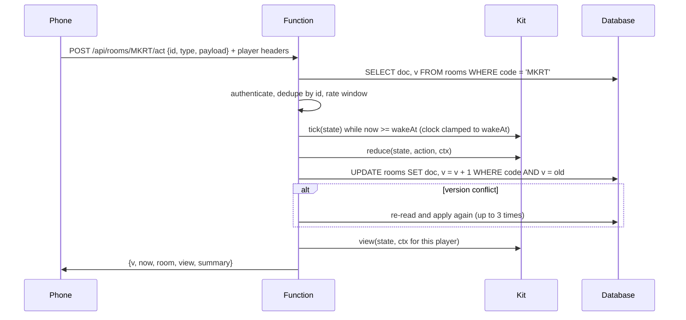
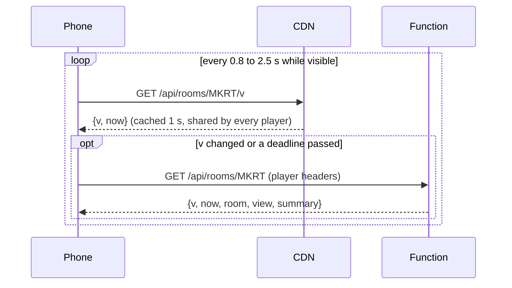
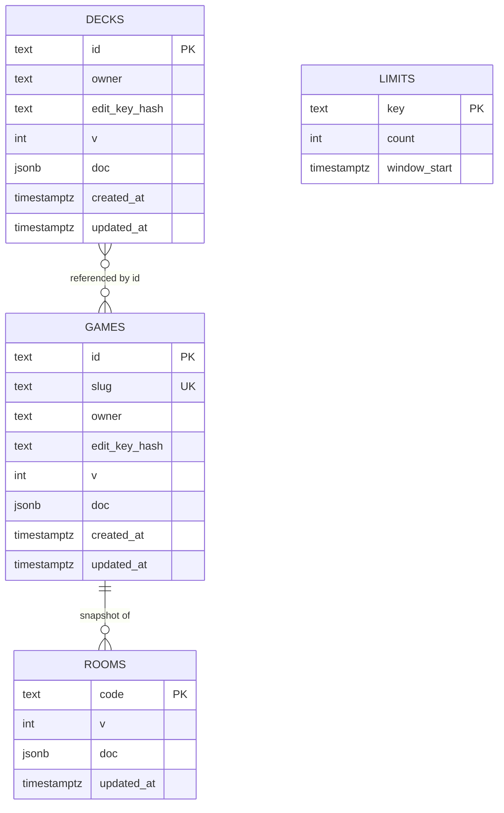

# Architecture

How a request flows, how a room lives, and where the data sits. Read `AGENTS.md` first for the map; this is the level below it.

## The pieces

Everything under `public/` is served as static files. One function answers every `/api/*` path. Kits are plain modules that both the function and the browser can import, but only the function runs their rules.

## A room's life

The room document (`RoomDoc` in `types/parlor.d.ts`) holds the game snapshot (kit id and version, settings, content, deck ids), the players and their secrets, the phase, the kit state `s`, the chat tail, the activity log, undo snapshots, seen action ids, per-player rate windows, and the recently seen card ids. It is written whole, with compare-and-set on its version.

## One action, end to end

Every action carries a client-made id; a retry after a lost response is applied once. Illegal actions throw `KitError` and change nothing. Views are redacted per player: any key starting with an underscore is stripped before the response leaves, and the conformance suite fails a kit that leaks one.

## Polling and time

Nothing runs on the server between requests. A kit that needs something to happen at a time sets `state.wakeAt`; the next request after that time runs `tick` with `ctx.now` clamped to the deadline, in a loop, until nothing is due. The client knows `wakeAt` from its view and asks for the state right after it (the host a little earlier than the rest), so reveals land on time. Every response carries the server's `now`; the client keeps a median offset and renders countdowns from server time.

## Data model

Built-in games and decks are modules under `public/games/` and `public/decks/`, listed in `public/shared/registry.js`; user-made ones are rows with the same document shape. A room stores deck ids and the versions it started with; cards are copied into kit state only when drawn.

## Locally

`server/dev.js` serves `public/` and mounts the same router in one process with the memory store, so several tabs share rooms. `npm test` runs the pure logic (kits through `tests/lib/sim.js`), the store contract against memory and a mocked Neon, the router with fake requests, and the room core; `npm run test:e2e` drives real browsers against the dev server.
